# CasaPlan – Belegungsplanung für ein geteiltes Ferienhaus

**Modul 223 – Multi-User-Applikationen objektorientiert realisieren**

| | |
|---|---|
| Autor | Nils Affolter |
| Klasse | 24-223-E |
| Datum | 21.09.2026 |
| Dokumentstatus | Projektdokumentation (Version 2.0, basierend auf dem Projektantrag vom 18.09.2026) |

---

## Inhaltsverzeichnis

1. [Problemstellung](#1-problemstellung)
2. [Projekt](#2-projekt)
3. [Anforderungsanalyse](#3-anforderungsanalyse)
4. [Benutzerrollen und Berechtigungen](#4-benutzerrollen-und-berechtigungen)
5. [Locking und Transaktionen](#5-locking-und-transaktionen)
6. [Datenmodell (ERM)](#6-datenmodell-erm)
7. [Breadboards der 1. Iteration](#7-breadboards-der-1-iteration)
8. [Screens der 1. Iteration](#8-screens-der-1-iteration)
9. [Glossar](#9-glossar)
10. [Projektstand und Prüfung der Anforderungen](#10-projektstand-und-prüfung-der-anforderungen)

---

## 1. Problemstellung

Meine Familie besitzt ein Ferienhaus in Moghegno im Vallemaggia (Tessin). Das Haus wird von mehreren Familienmitgliedern bzw. Parteien genutzt, die unabhängig voneinander Aufenthalte planen.

Heute wird die Belegung über Nachrichten und mündliche Absprachen koordiniert. Daraus entstehen wiederkehrende Probleme:

- **Doppelbelegungen:** Zwei Parteien planen denselben Zeitraum, weil eine Zusage mündlich gemacht und nirgends festgehalten wurde.
- **Fehlende Übersicht:** Niemand sieht auf einen Blick, wann das Haus frei ist. Wer einen Aufenthalt plant, muss zuerst herumfragen.
- **Konflikte um beliebte Zeiträume:** Ostern, Auffahrt und die Sommerferien sind bei allen gefragt. Ohne klare Regeln entsteht der Eindruck, dass einzelne Parteien bevorzugt werden.
- **Unklarer Status:** Es ist oft nicht klar, ob ein Aufenthalt nur angefragt oder bereits fest zugesagt ist.

**Relevanz und Häufigkeit:** Die Koordination betrifft jede Planung eines Aufenthalts. Das Haus wird rund 10-mal pro Jahr genutzt, Absprachen finden vor jeder Nutzung des Hauses statt.

### Sicht der Benutzer

- **Familienmitglieder** wollen schnell sehen, wann das Haus frei ist, einen Aufenthalt anfragen und verbindlich wissen, ob er bestätigt wurde.
- **Der Verwalter** (die Person, die die Belegung koordiniert) will Anfragen an einem Ort sehen, Konflikte sofort erkennen und faire Regeln für die Hochsaison durchsetzen, ohne jede Anfrage einzeln per Nachricht klären zu müssen.

---

## 2. Projekt

### Domäne

Belegungsplanung einer gemeinsam genutzten Ferienunterkunft innerhalb einer Familie.

### Name der Applikation

**CasaPlan**

### Vision

CasaPlan ersetzt die verstreute Absprache per Nachrichten durch einen gemeinsamen, verbindlichen Belegungsplan. Jedes Familienmitglied sieht jederzeit, wann das Ferienhaus frei ist, und kann einen Aufenthalt anfragen. Der Verwalter bestätigt Anfragen, wobei die Applikation garantiert, dass sich bestätigte Aufenthalte nie überschneiden, auch wenn mehrere Personen gleichzeitig arbeiten.

### Projektplanung: 1. MVP-Iteration

Die wichtigste domänenspezifische Funktion ist der **Ablauf von der Anfrage bis zur Bestätigung eines Aufenthalts ohne Überschneidung**.

**Fachlicher Ablauf:**

1. Ein Familienmitglied stellt eine Anfrage (Anreise, Abreise, Anzahl Personen, Bemerkung).
2. Die Applikation prüft, ob sich der Zeitraum mit einem bereits bestätigten Aufenthalt überschneidet. Falls ja, wird die Anfrage abgelehnt und der Konflikt angezeigt (Fehlerfall).
3. Der Verwalter sieht alle offenen Anfragen und bestätigt oder lehnt sie ab (mit Begründung).
4. Beim Bestätigen prüft die Applikation die Überschneidung erneut, da in der Zwischenzeit eine andere Anfrage für denselben Zeitraum bestätigt worden sein kann (Fachregel).
5. Das Familienmitglied sieht den neuen Status seiner Anfrage.

**Fachregel:** Bestätigte Aufenthalte im selben Haus dürfen sich zeitlich nicht überschneiden. Ein Aufenthalt, der am selben Tag beginnt, an dem ein anderer endet, gilt nicht als Überschneidung (Abreise am Vormittag, Anreise am Nachmittag).

**Fehlerfall:** Der gewünschte oder zu bestätigende Zeitraum überschneidet sich mit einem bestätigten Aufenthalt. Die Applikation speichert nichts, nennt den Konflikt (Zeitraum und Partei) und die eingegebenen Daten bleiben im Formular erhalten.

**Umfang der 1. Iteration:** FA1–FA5, Anmeldung und Registrierung mit Einladungscode (FA8), Rollen Familienmitglied und Verwalter mit Pundit, Transaktion beim Bestätigen, optimistisches Locking beim Bearbeiten, Aktivitätsprotokoll (FA11), verständliche Fehlermeldungen sowie Tests für Fachregel und Zugriffe.

**Rückmeldung Kursleiter:** Umfang genehmigt. Die Hochsaison-Regeln (FA7) werden nur umgesetzt, wenn Zeit bleibt.

**Technologie:** Ruby 4.0.6, Ruby on Rails 8.1, SQLite, Rails-Authentication, Pundit, Tailwind CSS.

---

## 3. Anforderungsanalyse

### Funktionale Anforderungen

Priorität: M = Muss, S = Soll, K = Kann

*Tabelle 1: Funktionale Anforderungen*

| ID | Anforderung | Prio |
|---|---|---|
| FA1 | Familienmitglied fragt Aufenthalt an. Bei Überschneidung mit einem bestätigten Aufenthalt wird die Anfrage abgewiesen. | M |
| FA2 | Verwalter bestätigt Anfrage, sofern keine Überschneidung besteht. | M |
| FA3 | Verwalter lehnt Anfrage mit Begründung ab. | M |
| FA4 | Angemeldete Benutzer sehen den Belegungsplan mit Status aller Aufenthalte. | M |
| FA5 | Familienmitglied bearbeitet oder zieht eigene offene Anfrage zurück. | M |
| FA6 | Anzahl Personen darf die Bettenanzahl nicht übersteigen. | S |
| FA7 | Verwalter legt Hochsaisons mit maximaler Anzahl Nächte fest. | K |
| FA8 | Neue Benutzer registrieren sich mit einem Einladungscode. Ohne gültigen Code ist keine Registrierung möglich. | M |
| FA9 | Benutzer ändern im Profil Name, Passwort (nur mit aktuellem Passwort) und E-Mail-Adresse (mit Bestätigungslink). | S |
| FA10 | Der Verwalter sieht alle Benutzer und kann Name, E-Mail-Adresse und Rolle anderer Benutzer ändern. | S |
| FA11 | Jede Änderung an einem Aufenthalt (Anfrage, Bearbeitung, Zurückziehen, Bestätigung, Ablehnung) wird protokolliert und in einem Aktivitäten-Feed angezeigt. | M |

FA8 bis FA11 wurden nach dem Projektantrag ergänzt, weil die Projektaufgaben des Moduls Registrierung, Benutzerprofil, Benutzerverwaltung und ein Aktivitätsprotokoll verlangen. Die Registrierung erfolgt mit Einladungscode, weil der Belegungsplan privat ist: Mit einer offenen Registrierung könnte jede fremde Person sehen, wann das Haus leer steht.

### Qualitätsattribute

*Tabelle 2: Qualitätsattribute*

| ID | Attribut | Anforderung | Prio |
|---|---|---|---|
| NFA1 | Datenkonsistenz | Werden zwei überlappende Anfragen gleichzeitig bestätigt, wird genau eine bestätigt. | M |
| NFA2 | Zugriffsschutz | Ein direkter Bestätigungs-Request eines Familienmitglieds wird abgewiesen, der Status bleibt unverändert. | M |
| NFA3 | Konkurrierende Änderungen | Bearbeitet ein Familienmitglied eine Anfrage, die inzwischen geändert oder entschieden wurde, wird nicht gespeichert. Es erscheint eine Meldung, und die Eingaben bleiben erhalten. | M |
| NFA4 | Performance | Der Belegungsplan lädt bei 500 Aufenthalten und 10 gleichzeitigen Aufrufen in unter 1 Sekunde. | K |

NFA3 wurde von S auf M angehoben, da optimistisches Locking Teil der 1. Iteration ist.

---

## 4. Benutzerrollen und Berechtigungen

*Tabelle 3: Rollen*

| Rolle | Beschreibung |
|---|---|
| Familienmitglied | Person, die das Ferienhaus nutzt und Aufenthalte anfragt. |
| Verwalter | Person, die die Belegung koordiniert und Anfragen verbindlich bestätigt oder ablehnt. Ein Verwalter kann auch selbst Aufenthalte anfragen. |
| Gast (nicht angemeldet) | Keine Rolle im eigentlichen Sinn. Hat nur Zugriff auf Anmeldung, Registrierung und Passwort-Zurücksetzen. |

### Berechtigungsmatrix

*Tabelle 4: Berechtigungsmatrix*

| Aktion | Gast | Familienmitglied | Verwalter |
|---|---|---|---|
| Registrieren (mit Einladungscode) | ✓ | – | – |
| Belegungsplan und Aktivitäten ansehen | – | ✓ | ✓ |
| Aufenthalt anfragen | – | ✓ | ✓ |
| Eigene offene Anfrage bearbeiten / zurückziehen | – | ✓ | ✓ |
| Fremde offene Anfrage bearbeiten / zurückziehen | – | – | ✓ |
| Anfrage bestätigen / ablehnen | – | – | ✓ |
| Eigenes Profil ansehen und ändern | – | ✓ | ✓ |
| Benutzer verwalten (ohne eigene Rolle) | – | – | ✓ |
| Hochsaison-Zeiträume verwalten (FA7, nicht umgesetzt) | – | – | ✓ |

Die Berechtigungen werden serverseitig mit Pundit-Policies durchgesetzt (`StayPolicy`, `UserPolicy`, `ActivityPolicy`). Jede Policy verbietet standardmässig alles («Deny by default»). Die Views blenden nicht erlaubte Aktionen zusätzlich aus. Das Profil ist als Singular-Ressource (`/profile`) umgesetzt: Die URL enthält keine ID, der Controller verwendet immer den angemeldeten Benutzer. Ein fremdes Profil kann dadurch gar nicht aufgerufen werden.

---

## 5. Locking und Transaktionen

Die Applikation verwendet SQLite. SQLite sperrt keine einzelnen Zeilen: `lock!` bzw. `SELECT … FOR UPDATE` haben keine Wirkung. Stattdessen startet Rails 8.1 jede Transaktion mit `BEGIN IMMEDIATE`. Damit kann immer nur eine Verbindung gleichzeitig eine Schreibtransaktion halten, weitere warten, bis die erste abgeschlossen ist. Der Projektantrag sah einen Lock auf das Haus vor. Dieses Konzept wurde auf das Verhalten von SQLite angepasst.

### Anfrage bestätigen, ablehnen, zurückziehen (FA2, FA3, FA5) – Transaktion mit Schreibsperre

**Problem:** Die Fachregel «keine Überschneidung» lässt sich nicht mit einem Unique-Index absichern, weil sich Zeiträume teilweise überlappen können. Die Prüfung erfolgt in der Applikation: zuerst lesen, dann schreiben. Bestätigen zwei Verwalter-Sitzungen gleichzeitig zwei überlappende Anfragen, könnten beide Prüfungen «kein Konflikt» ergeben.

**Lösung:** Die Statusänderung läuft in einer Transaktion (`Stay#transition_to`). Der Aufenthalt wird **innerhalb** der Transaktion neu geladen, danach folgen Überschneidungsprüfung (Validierung), Statusänderung und Aktivitätseintrag. Wegen `BEGIN IMMEDIATE` wartet eine zweite, gleichzeitige Bestätigung, bis die erste abgeschlossen ist, und sieht danach den bereits bestätigten Aufenthalt. Die Validierung schlägt fehl, und es wird nichts gespeichert.

```ruby
def transition_to(new_status, actor:, **attributes)
  self.class.transaction do
    reload
    assign_attributes(status: new_status, **attributes)
    save!
    activities.create!(user: actor, event: new_status.to_s, summary: summary_text)
  end
  true
rescue ActiveRecord::RecordInvalid
  restore_attributes(%w[status decided_by_id decided_at])
  false
end
```

### Aufenthalt und Aktivität gemeinsam speichern (FA1, FA5, FA11) – Transaktion

Jede Änderung an einem Aufenthalt und der dazugehörige Aktivitätseintrag werden in einer Transaktion gespeichert (`Stay#save_with_activity`). Schlägt der Aktivitätseintrag fehl, wird auch die Änderung am Aufenthalt zurückgerollt. So gibt es keine Änderung ohne Protokolleintrag.

### Anfrage bearbeiten (FA5) – optimistisches Locking

**Problem:** Ein Familienmitglied öffnet das Formular seiner Anfrage. Währenddessen ändert oder entscheidet der Verwalter die Anfrage. Speichert das Familienmitglied danach, würde es die neuere Änderung unbemerkt überschreiben.

**Lösung:** Die Tabelle `stays` hat eine Spalte `lock_version`. Das Formular sendet die beim Öffnen gelesene Version als verstecktes Feld mit. Ist die Version beim Speichern veraltet, wirft Rails `ActiveRecord::StaleObjectError`. Der Controller zeigt eine verständliche Meldung (HTTP 409), die Eingaben bleiben im Formular erhalten. Wurde die Anfrage inzwischen entschieden, verhindert zusätzlich die Validierung «Nur offene Anfragen können geändert werden» das Speichern. Ein Datenbank-Lock wäre ungeeignet, da ein Formular lange offen sein kann.

### Passwort ändern (FA9) – Transaktion

Das neue Passwort wird gespeichert und alle anderen Sitzungen des Benutzers werden beendet. Beide Schritte laufen in einer Transaktion: Scheitert einer, wird keiner ausgeführt.

### E-Mail-Adresse ändern (FA9)

Die neue Adresse wird zuerst als `unconfirmed_email` mit einem zufälligen Token gespeichert. Erst **nach** erfolgreichem Speichern wird die Bestätigungs-E-Mail verschickt, denn eine verschickte E-Mail lässt sich nicht zurückrollen. Hat sich zwischen Anfrage und Bestätigung ein anderes Konto mit derselben Adresse registriert, verhindern die Validierung bzw. der eindeutige Index die doppelte Adresse, und der Benutzer erhält eine Meldung.

---

## 6. Datenmodell (ERM)

*Abbildung 1: ERM (Stand Umsetzung)*

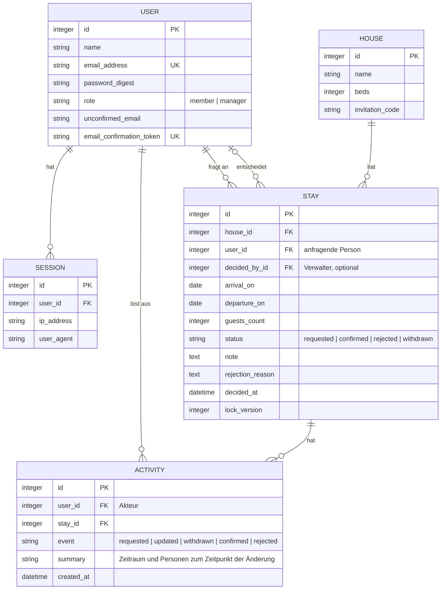

Änderungen gegenüber dem Projektantrag: `ACTIVITY` (Aktivitätsprotokoll), `invitation_code` beim Haus (Registrierung) sowie `unconfirmed_email` und `email_confirmation_token` beim Benutzer (E-Mail-Änderung) wurden ergänzt. `SEASON` (Hochsaison, FA7) wurde nicht umgesetzt. Das Modell ist für mehrere Häuser vorbereitet, die Applikation verwendet aber genau eines.

---

## 7. Breadboards der 1. Iteration

Notation nach Shape Up: **Orte** (Seiten) mit ihren **Affordanzen** (Links, Buttons, Felder)
und **Verbindungen** dazwischen.

*Abbildung 2: Registrieren und Anmelden*
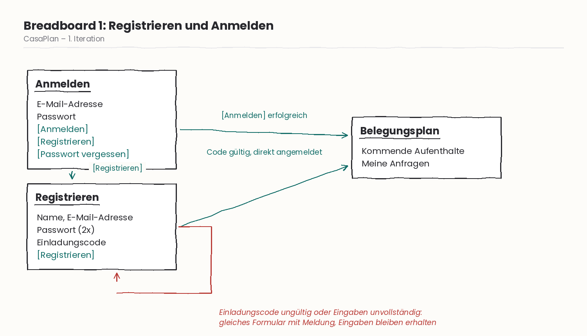

*Abbildung 3: Aufenthalt anfragen (Familienmitglied)*
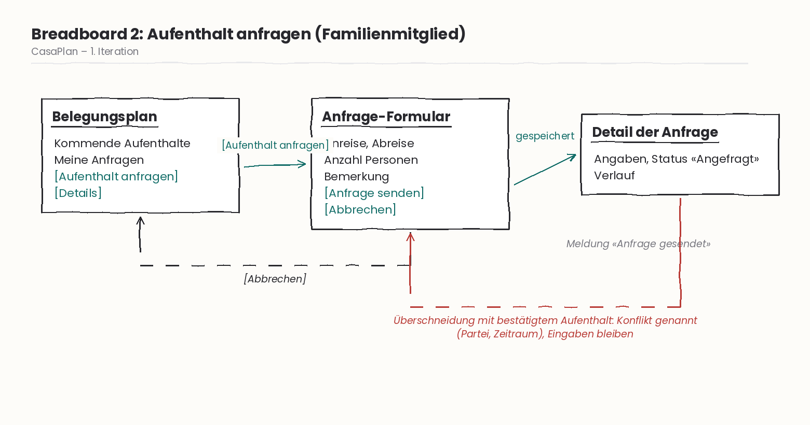

*Abbildung 4: Anfrage bestätigen oder ablehnen (Verwalter)*
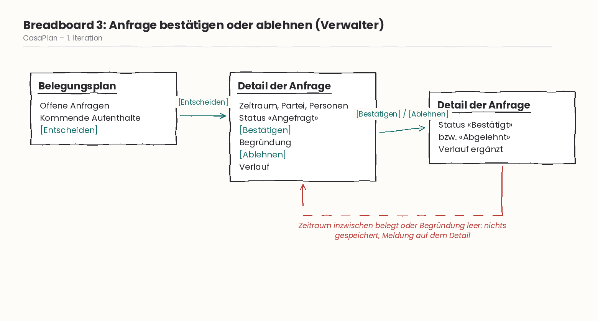

*Abbildung 5: Eigene Anfrage bearbeiten oder zurückziehen*
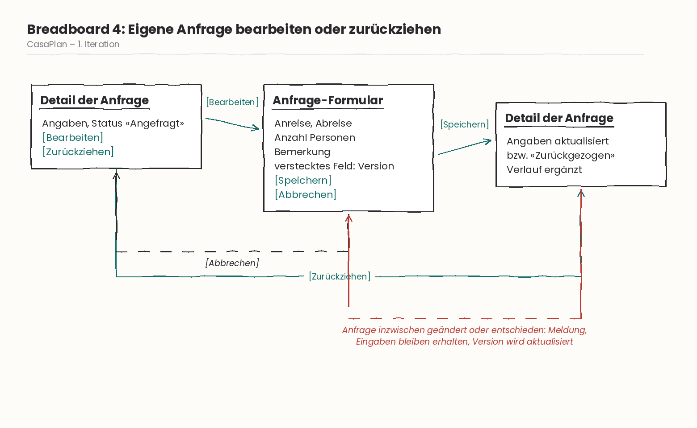

## 8. Screens der 1. Iteration

*Abbildung 6: Anmelden und Registrieren*
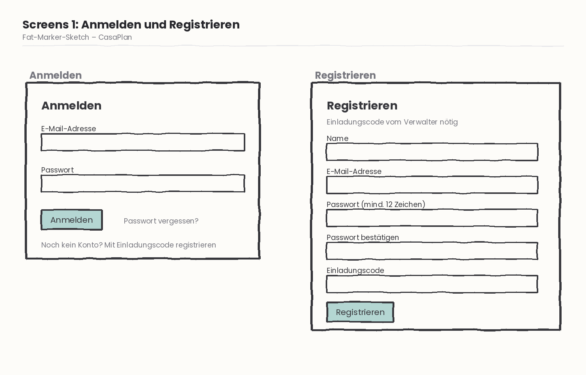

*Abbildung 7: Belegungsplan (Ansicht Verwalter mit offenen Anfragen)*
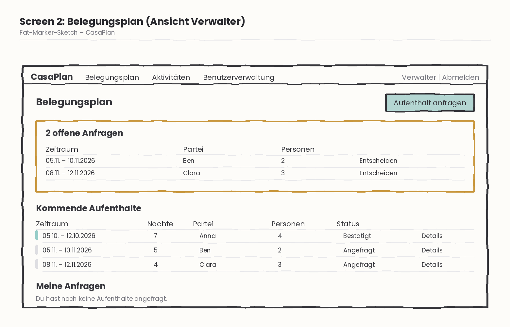

*Abbildung 8: Anfrage-Formular mit Fehlermeldung bei Überschneidung*
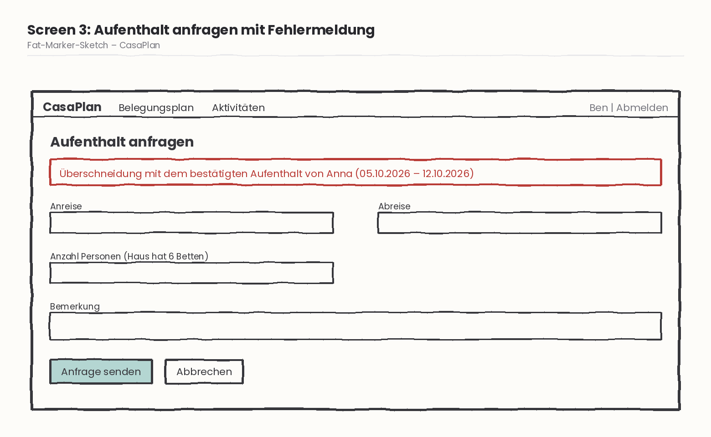

*Abbildung 9: Detail der Anfrage mit Bestätigen, Ablehnen und Verlauf*
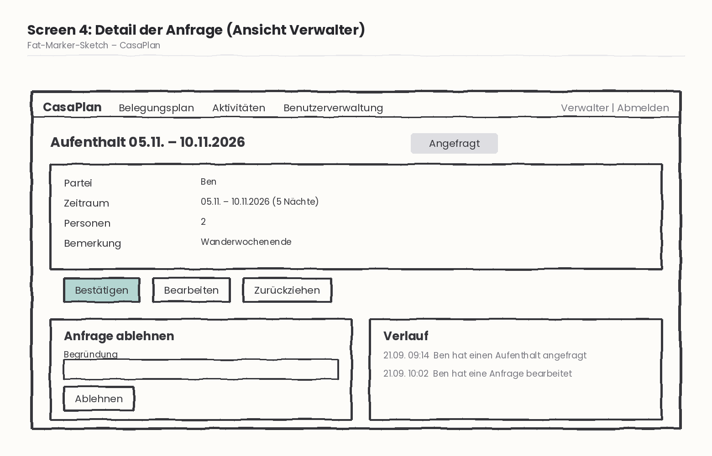

*Abbildung 10: Mein Profil und Benutzerverwaltung*
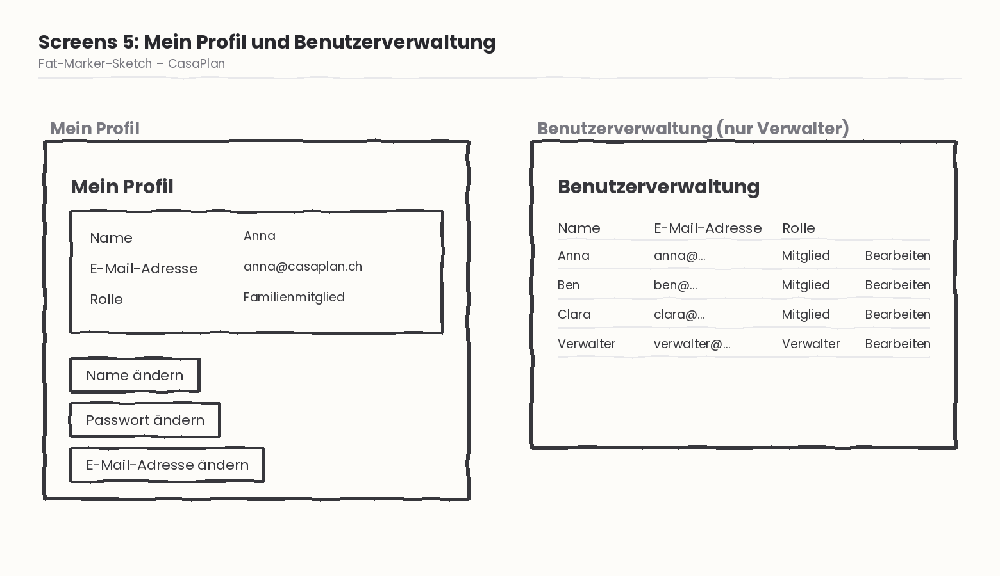

---

## 9. Glossar

*Tabelle 6: Glossar*

| Begriff | Bedeutung |
|---|---|
| Aufenthalt | Zeitraum, in dem eine Partei das Ferienhaus nutzt oder nutzen möchte (Modell `Stay`). |
| Anfrage | Aufenthalt mit dem Status «Angefragt», über den der Verwalter noch nicht entschieden hat. |
| Bestätigter Aufenthalt | Aufenthalt, den der Verwalter verbindlich zugesagt hat. Nur diese blockieren den Zeitraum. |
| Überschneidung | Zwei Aufenthalte teilen mindestens eine Nacht. Gleicher Abreise- und Anreisetag gilt nicht als Überschneidung. |
| Partei | Familienmitglied bzw. Haushalt, der einen Aufenthalt anfragt. Entspricht einem Benutzerkonto. |
| Verwalter | Rolle, die Anfragen bestätigt oder ablehnt und Benutzer verwaltet. |
| Aktivität | Protokolleintrag zu einer Änderung an einem Aufenthalt (Modell `Activity`). |
| Einladungscode | Geheimer Code des Hauses, der für die Registrierung nötig ist. |

---

## 10. Projektstand und Prüfung der Anforderungen

### Erreichter Stand

Umgesetzt sind FA1–FA6 und FA8–FA11, die Rollen Familienmitglied und Verwalter mit Pundit, die Transaktionen und das optimistische Locking gemäss Kapitel 5 sowie automatisierte Tests.

### Abweichungen vom Projektantrag

*Tabelle 7: Abweichungen*

| Abweichung | Begründung |
|---|---|
| Lock auf das Haus ersetzt durch Transaktion mit `BEGIN IMMEDIATE` | SQLite unterstützt keine Zeilensperren (siehe Kapitel 5). |
| FA8–FA11 ergänzt | Von den Projektaufgaben des Moduls verlangt. |
| Registrierung nur mit Einladungscode | Der Belegungsplan ist privat. |
| Offene Anfragen auf dem Belegungsplan statt auf einer eigenen Seite | Weniger Navigation für den Verwalter; alle Informationen auf einem Blick. |
| FA7 (Hochsaison) nicht umgesetzt | Gemäss Rückmeldung des Kursleiters nur, falls Zeit bleibt. |
| Gem `json` auf Version `< 3` beschränkt | Inkompatibilität zwischen `json` 3.x und ActiveSupport 8.1.3.1 beim Lesen des Session-Cookies. |

### Offene Punkte

- FA7 (Hochsaison-Regeln) ist nicht umgesetzt.
- Der Einladungscode kann nur über die Datenbank bzw. die Konsole geändert werden, nicht über die Oberfläche. Wird er weitergegeben, kann sich jede Person registrieren, die ihn kennt.
- E-Mails werden in der Entwicklungsumgebung nur als Datei abgelegt (`tmp/mails/`).
- Der Bestätigungslink für eine neue E-Mail-Adresse hat kein Ablaufdatum.

### Prüfung der Anforderungen

Alle automatisierten Tests laufen erfolgreich: `bin/rails test` ergibt
**78 runs, 263 assertions, 0 failures, 0 errors**.

*Tabelle 8: Prüfung der Anforderungen*

| ID | Prüfung | Ergebnis |
|---|---|---|
| FA1 | `StayTest` (Überschneidung, gleicher Wechseltag), `StaysControllerTest` | bestanden |
| FA2 | `StayTest`, `StaysControllerTest` «manager confirms a request» | bestanden |
| FA3 | `StayTest` «rejecting requires a reason», `StaysControllerTest` | bestanden |
| FA4 | `StaysControllerTest` «family member sees the occupancy plan» | bestanden |
| FA5 | `StaysControllerTest` (bearbeiten, zurückziehen) | bestanden |
| FA6 | `StayTest` «more guests than beds is invalid» | bestanden |
| FA8 | `RegistrationsControllerTest` | bestanden |
| FA9 | `ProfilesControllerTest`, `Profile::PasswordsControllerTest`, `Profile::EmailsControllerTest` | bestanden |
| FA10 | `Admin::UsersControllerTest`, `UserPolicyTest` | bestanden |
| FA11 | `StayTest` (Transaktion), `ActivitiesControllerTest`, `ActivityPolicyTest` | bestanden |
| NFA1 | `StayTest` «second of two overlapping requests cannot be confirmed» plus manuelle Prüfung mit zwei Browserfenstern | bestanden |
| NFA2 | `StaysControllerTest` (direkte Requests), `StayPolicyTest` | bestanden |
| NFA3 | `StayTest` (veraltete Version), `StaysControllerTest` (Konflikt im Formular) | bestanden |
| NFA4 | Manuelle Messung, nicht automatisiert | offen |

### Aussagekraft der Tests

Um zu prüfen, ob die Tests einen echten Fehler erkennen, wurde die Fachregel bewusst verfälscht:
Im Scope `overlapping` (`app/models/stay.rb`) wurden die strikten Vergleiche `<` und `>` durch
`<=` und `>=` ersetzt. Damit gilt ein Wechsel am selben Tag fälschlicherweise als Überschneidung.

*Abbildung 11: Zwei Tests schlagen fehl, «arrival on the departure day of a confirmed stay is allowed» und «departure on the arrival day of a confirmed stay is allowed» (78 runs, 2 failures). Die Tests erkennen die verletzte Fachregel also zuverlässig.*

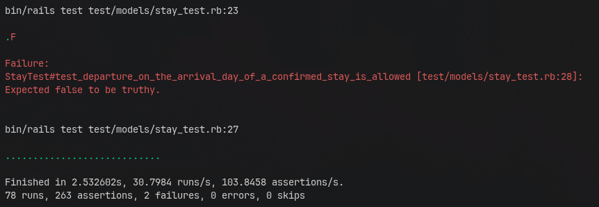

Nach dem Rückgängigmachen der Änderung laufen wieder alle Tests erfolgreich durch.